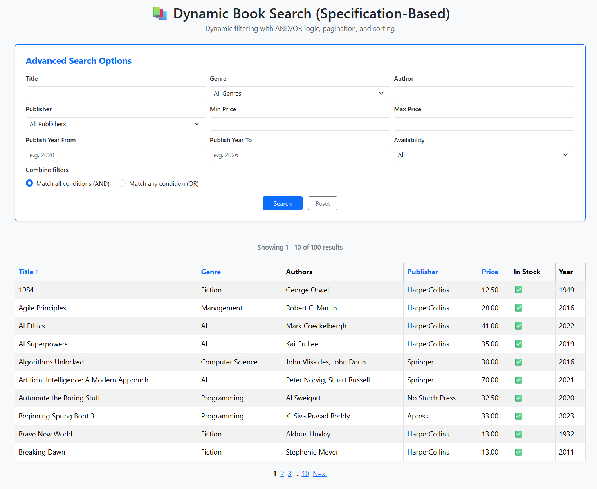
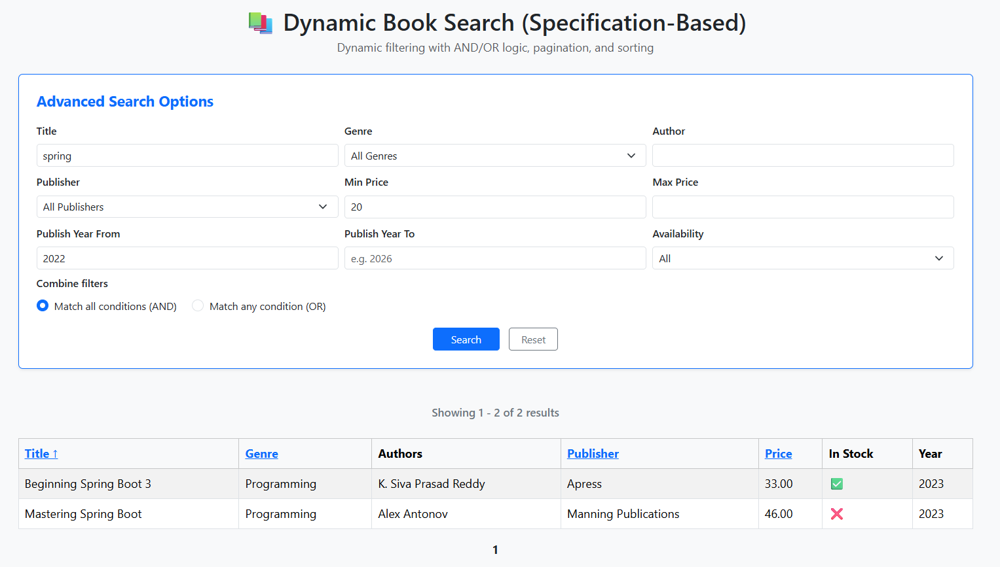

<div align="center">

# Dynamic Book Search

</div>

A book search application built with **Spring Boot** that supports flexible filtering and dynamic query composition through **Spring Data JPA Specifications**. The same search flow is available through both a **REST API** and a server rendered UI built with **Thymeleaf**.

The project uses **PostgreSQL** for persistence, **Flyway** for schema management, **Docker** for local and demo execution, and **GitHub Actions** for CI and release automation.


<p align="center">
  
</p>

## Quick start

Prerequisites:
- Docker installed

Run the application:

```bash
git clone https://github.com/shirinjamshidiyan/dynamic-book-search
cd dynamic-book-search
cp .env.example .env
docker compose up
```

Then open: `http://localhost:8080/view/books`

## What the project does

The application supports flexible and dynamic search across a bookstore dataset. Users can search through either a web interface or a REST endpoint, using the same underlying search logic in both cases.

Supported filters include:
- `Title`
- `Genre`
- `Author`
- `Publisher`
- `Minimum price`
- `Maximum price`
- `Publish year from`
- `Publish year to`
- `Availability`
- `Search mode` (`AND` / `OR`)

The search design supports:

- Partial matching for fields such as `Title`, `Author`, and `Publisher`
- Range filtering for price and publish year
- Configurable `AND` / `OR` search logic
- Pagination and sorting
- Validation in both the API and the UI

## Core implementation choices

This project is **not** built around hard coded repository query methods. Search behavior is composed dynamically with Spring Data JPA Specifications, which keeps the filtering logic flexible as the number of optional criteria grows.

The application uses **profile specific configuration** with separate YAML and Compose files for different execution scenarios.

The project also separates the core search logic from the API and UI layers, following a **Clean Architecture** approach. This makes the code easier to test and easier to change. The same use case is exposed through:
- A REST API for programmatic access
- A server rendered web UI for interactive search


## Architecture

The project follows a layered structure inspired by clean architecture.

```text
src/main/java/com/shirin/jpaspecdynamicsearchapp
├─ book
│  ├─ application
│  │  └─ search
│  ├─ domain
│  ├─ infrastructure
│  └─ web
│     ├─ api
│     └─ view
├─ publisher
│  ├─ domain
│  └─ infrastructure
└─ JpaSpecDynamicSearchAppApplication.java
```

### Package responsibilities

- **Domain**  
  Core business entities such as `Book` and `Publisher`

- **Application**  
  Search use cases, criteria models, result models, and validation logic

- **Infrastructure**  
  Persistence related components such as repositories and specification builders

- **Web**  
  Delivery specific code for the REST API and the Thymeleaf based UI

## Database and migrations

The application uses **PostgreSQL** in both development and production setups. This avoids differences between development and production and keeps query behavior closer to real deployment conditions.

**Development seed data is loaded only in development oriented runs**.

Database schema creation and evolution are managed with **Flyway migrations** rather than Hibernate schema generation.

### Migration layout:

```text
src/main/resources/
├─ db/migration/
│  └─ V1__create_schema.sql
└─ dev/db/migration/
   └─ V2__seed_sample_data.sql
```

This keeps the base schema separate from development seed data:

- `V1` defines the schema
- Development seed data is isolated from the main migration set
- Development runs can start with demo data
- Production oriented runs stay clean

## Containerization

The repository includes:

- A multi-stage `Dockerfile` for the application image
- Compose files for demo, local development, and production oriented runs
- Environment driven configuration through `.env`

This keeps local setup more predictable and makes the project easier to run across different environments.

### Repository structure

```text
.
├─ .github/workflows
├─ src
├─ Dockerfile
├─ compose.yaml
├─ compose.local.yaml
├─ compose.prod.yaml
├─ .env.example
├─ pom.xml
└─ README.md
```

### Compose files

- `compose.yaml`  
  Demo flow using the published image with the development profile

- `compose.local.yaml`  
  Local development flow that builds the application from source

- `compose.prod.yaml`  
  Production oriented flow using the published image and the production profile

The repository includes `.env.example` as a template for local configuration.

## Running the project

Copy the example environment file first:

```bash
cp .env.example .env
```

Then update the values in `.env` before starting the application (Optional).

### Demo flow

Uses `compose.yaml`, pulls the published image, runs with the development profile, and loads development seed data.

```bash
docker compose up
```

### Local development flow

Uses `compose.local.yaml`, builds from local source, runs with the development profile, and is intended for active development.

```bash
docker compose -f compose.local.yaml up --build
```

### Production oriented flow

Uses `compose.prod.yaml`, pulls the published image, runs with the production profile, and does not load development seed data.

```bash
docker compose -f compose.prod.yaml up
```

After startup, open: `http://localhost:8080/view/books`

## REST API overview

### Search endpoint

```http
POST /api/books/search
Content-Type: application/json
```

### Example request

```json
{
  "title": "spring",
  "minPrice": 20,
  "publishYearFrom": 2023,
  "searchMode": "AND"
}
```

### Example response

```json
{
  "content": [
    {
      "id": 9,
      "title": "Beginning Spring Boot 3",
      "genre": "Programming",
      "price": 33.00,
      "publishYear": 2023,
      "availability": true,
      "publisherId": 10,
      "publisherName": "Apress",
      "authors": [
        "K. Siva Prasad Reddy"
      ]
    },
    {
      "id": 73,
      "title": "Mastering Spring Boot",
      "genre": "Programming",
      "price": 46.00,
      "publishYear": 2023,
      "availability": false,
      "publisherId": 7,
      "publisherName": "Manning Publications",
      "authors": [
        "Alex Antonov"
      ]
    }
  ],
  "page": 0,
  "size": 10,
  "totalElements": 2,
  "totalPages": 1
}
```

### Validation example

Invalid request:

```json
{
  "title": "spring",
  "publishYearFrom": 2023,
  "publishYearTo": 2020
}
```

Response:

```json
{
  "timestamp": "2026-04-14T12:22:16.618839989",
  "status": 400,
  "error": "Bad Request",
  "message": "Validation Failed",
  "path": "/api/books/search",
  "fieldErrors": [
    {
      "field": "publishYearFrom",
      "message": "Publish year from cannot be greater than publish year to"
    }
  ]
}
```

## UI overview

The UI exposes the same search use case through a Thymeleaf based page.

<p align="center">
  
</p>

The results table supports dynamic sorting by clicking on the column headers — toggling between ascending and descending order — making it easy to explore and find books efficiently.

It also works together with pagination, which makes it easier to browse larger result sets.

## CI and release automation

GitHub Actions is used for both CI and release automation.

### CI workflow

The CI workflow runs on pull requests and pushes to `main`. It performs:

- Maven verification
- Unit and integration test execution
- Formatting checks with Spotless
- Static analysis with SpotBugs
- Coverage artifact generation with JaCoCo
- Secret scanning with Gitleaks

### Release workflow

The release workflow runs on version tags such as `v1.0.0`. It performs:

- Application verification
- SBOM generation with CycloneDX
- Docker image build
- Container image scanning with Trivy
- Docker image publication to Docker Hub
- GitHub Release creation
- SBOM attachment to the release

## Technology stack

- Java 17
- Spring Boot 3.5
- Spring Web
- Spring Data JPA
- Thymeleaf
- Bean Validation
- PostgreSQL
- Flyway
- Maven
- Docker
- Docker Compose
- GitHub Actions
- JUnit 5
- AssertJ
- Testcontainers
- JaCoCo
- Spotless
- SpotBugs
- Gitleaks
- Trivy
- CycloneDX

## Docker image

Available on Docker Hub: `shirinjam/dynamic-book-search`
```bash
docker pull shirinjam/dynamic-book-search:latest
```

## Author

Shirin Jamshidiyan


